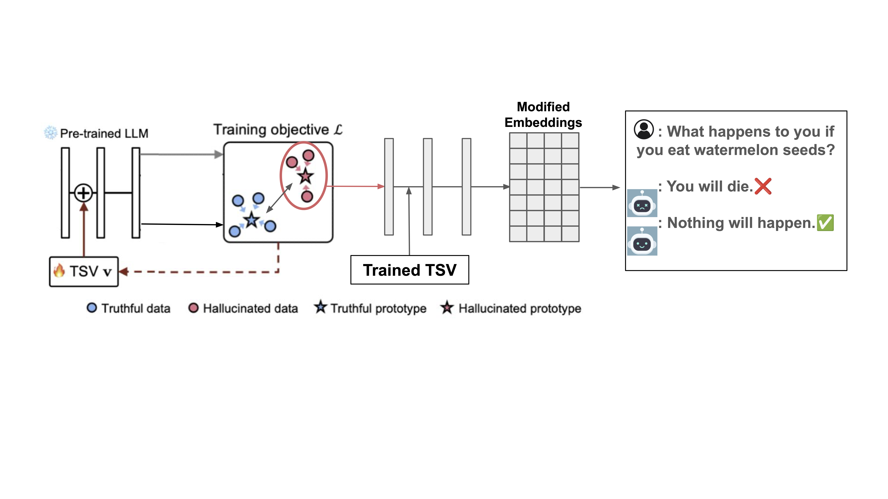

# TSV Guided Hallucination Detection with ITI Approach

# Introduction
Large Language Models (LLMs) frequently produce hallucinated outputs that limits their reliability in high-stakes applications. Prior work usually treated hallucination detection and mitigation as separate problems. In this work, we bridge a lightweight hallucination detection approach-Truthfulness Separator Vector (TSV). We introduce three TSV-guided inference-time mitigation strategies—prototype-aware projection, prototype interpolation, and adaptive mitigation—that intervene on model hidden states during inference without modifying model parameters. Experiments show that TSV-guided interventions can consistently improve truthfulness metrics over the default baseline while incurring minimal distributional shift, as measured by KL divergence. Overall, our results highlight the potential of combining latent-space hallucination detection with lightweight inference-time intervention as an effective approach to hallucination mitigation in LLMs.


---

# Our innovation
The current project is an extension of the TSV and ITI approach. As the TSV showed outstanding performance on detecting hallucinated answers from LLMs, we propose that the TSV can be used to guide where (which llm layer) to add the treatment, and whom (hallucinated responses) to achieve better hallucination mitigation outcomes. 

Besides, we modify the classification objective function to make make the two distributions (truthful and hallucinated) to be as far as possible so that it can handle edge cases better.

---

# Method

Our framework consists of two stages: **hallucination detection** using TSV-style latent supervision, and **hallucination mitigation** via inference-time intervention (ITI) guided by the learned TSV signal. 

## Overview



---

## Detection Stage: TSV-Guided Hallucination Detection

We adapt the **Truthfulness Separator Vector (TSV)** framework to detect hallucinated LLM outputs, with additional modifications to improve robustness in edge cases.

In this stage, we:
- Extract hidden representations from a selected intermediate layer of the LLM
- Maintain two latent prototypes corresponding to:
  - **truthful responses**
  - **hallucinated responses**
- Learn a **TSV direction** that separates these two distributions in latent space

During training, representations are classified based on cosine similarity to the two prototypes, after being shifted along the TSV direction. In addition to the standard TSV objective, we introduce a **distribution separation regularizer** that explicitly pushes the truthful and hallucinated prototypes away from each other. This improves calibration and helps the detector handle ambiguous or borderline cases.

The class prototypes are **not directly optimized parameters**. Instead, they are updated using an **exponential moving average (EMA)** over batch representations, which stabilizes training and reduces noise.

The detection stage outputs:
- a trained hallucination detector, and
- a learned TSV that steers the hidden states, and
- hallucinated and truthful centroids.

---

## Mitigation Stage: TSV-Guided Inference-Time Intervention

In the mitigation stage, we use the learned TSV signal to intervene on the LLM’s hidden states **during inference**, following the inference-time intervention (ITI) paradigm.

When a generated token is detected as hallucinated, we modify the hidden state at a selected transformer layer using one of the following strategies:

### 1. Prototype-Aware Projection

The hidden state is shifted along the TSV direction to move it toward the truthful region of latent space.

---

### 2. Prototype Interpolation

The hidden state is interpolated directly toward the truthful prototype.

---

### 3. Adaptive Mitigation

Instead of relying on class prototypes, we directly inject the TSV direction into the hidden state with a tunable scaling factor.

---
For full mathematical details and experimental analysis, please refer to the accompanying paper. 
---

# Main Results
### LLaMA-8B-Instruct

For **LLaMA-8B-Instruct**, we observe modest improvements in both **Truthful–Informative (T–I)**
scores and **MC1** accuracy for selected method–layer combinations.
In particular, **prototype projection at layer 16** and **adaptive mitigation at layers 16 and 32**
improve T–I compared with the baseline model.
The **prototype interpolation** method does not consistently improve truthfulness over the baseline.

Marginal improvement in multiple-choice accuracy (MC1) is observed when **prototype projection**
is injected at layer 6.
Across all mitigation strategies and layers, the **KL divergence** between intervened and
unintervened embeddings remains low (typically `< 0.1`), indicating minimal distributional shift.

### Qwen-2.5-7B-Instruct

For **Qwen-2.5-7B-Instruct**, the largest improvement in **T–I** is achieved by applying
**prototype interpolation at layer 6**, with an absolute gain of approximately `+0.03`
over the baseline.
In contrast, projection and adaptive mitigation lead to smaller or negligible improvements
in T–I across layers.

Improvements in **MC1** accuracy are not significant for Qwen, with the largest gains being
below `0.01`.
The **KL divergence** remains very low for prototype projection and adaptive mitigation
(typically `< 0.01`), while prototype interpolation at layers `{6, 10, 16}` induces
moderate distributional shifts compared with the baseline embeddings.

---

<details>
<summary><b>Full Evaluation Results (TruthfulQA)</b></summary>

### LLaMA-8B-Instruct

| Method | Layer | T–I | MC1 | KL |
|------|------|------|------|------|
| Prototype Projection | 6 | 0.427 | **0.403** | 0.019 |
|  | 10 | 0.438 | 0.381 | 0.010 |
|  | 16 | 0.461 | 0.394 | 0.006 |
|  | 32 | 0.400 | 0.394 | 0.000 |
| Adaptive Mitigation | 6 | 0.376 | 0.394 | 0.040 |
|  | 10 | 0.419 | 0.384 | 0.025 |
|  | 16 | 0.467 | 0.391 | 0.038 |
|  | 32 | **0.471** | 0.395 | 0.003 |
| Prototype Interpolation | 6 | 0.387 | 0.365 | 0.090 |
|  | 10 | 0.353 | 0.372 | 0.079 |
|  | 16 | 0.424 | 0.399 | 0.091 |
|  | 32 | 0.446 | 0.391 | 0.000 |
| **Baseline** | — | 0.447 | 0.391 | 0.000 |

---

### Qwen-2.5-7B-Instruct

| Method | Layer | T–I | MC1 | KL |
|------|------|------|------|------|
| Prototype Projection | 6 | 0.390 | 0.456 | 0.000 |
|  | 10 | 0.403 | 0.458 | 0.000 |
|  | 16 | 0.390 | 0.456 | 0.000 |
|  | 28 | 0.386 | 0.454 | 0.000 |
| Adaptive Mitigation | 6 | 0.403 | **0.459** | 0.003 |
|  | 10 | 0.370 | 0.453 | 0.002 |
|  | 16 | 0.395 | 0.449 | 0.002 |
|  | 28 | 0.403 | 0.458 | 0.000 |
| Prototype Interpolation | 6 | **0.429** | 0.414 | 0.191 |
|  | 10 | 0.373 | 0.318 | 0.211 |
|  | 16 | 0.359 | 0.381 | 0.346 |
|  | 28 | 0.381 | 0.456 | 0.000 |
| **Baseline** | — | 0.396 | 0.456 | 0.000 |

</details>


---

### Summary

Overall, TSV-guided mitigation yields **small but consistent improvements** in truthfulness
metrics without substantially perturbing the underlying embedding distribution.
Adaptive mitigation tends to be more effective at **deeper layers**, while prototype
interpolation can be effective at **earlier layers** but may introduce larger distributional
changes.


# Reproducing Our Results

---

## Hallucination detection stage
```bash
cd detection
```

### Requirements

```bash
conda env create -f tsv.yml
```
---

### LLM response generation

Generate responses for each question to construct an unlabeled QA dataset in the wild.

```bash
bash gen.sh
```

---

### GT generation

Generate [BLEURT](https://arxiv.org/abs/2004.04696) score for each QA pair


```bash
bash gt.sh
```

---

### Train TSV

Train TSV for hallucination detection.

```bash
bash train.sh
```

---

## Mitigation Stage
```bash
cd mitigation
```
## Prepare trained TSV and prototypes
From detection branch, copy the folder with name of the model (e.g., TSV_llama3.1-8B_tqa) into the mitigation folder. Arrange it as the follow: 
- `/tsv_info/layer_{layer_number}/{file_name}`

### Requirement
## Requirements

### 1. API Tokens

Create the following files in the project root (without quotes):

- `token.txt` — Hugging Face access token  
- `open_ai_key.txt` — OpenAI / ChatGPT API key  

---

### 2. Install Required Dependencies

Run the following commands to install all required Python packages:

```bash
pip install t5
pip install git+https://github.com/meta-llama/llama
pip install git+https://github.com/davidbau/baukit
pip install -U transformers
pip install pyvene
pip install evaluate

cd TruthfulQA
pip install -r requirements.txt
pip install -e .
cd ..

pip install datasets==2.19
pip install "numpy<2.0.0"
pip install huggingface_hub
pip install git+https://github.com/google-research/bleurt.git
```

### 3. Run Mitigation
Run TSV-guided mitigation by specifying the intervention layer and mitigation mode:

```bash
python main.py \
  --layer_id <LAYER_ID> \
  --mode <MODE>
```

### 4. Dataset Configuration
#### Directory Structure
Access the saved TSV and prototypes from the detection folder, and organize them as the following directory under mitigation:

```text
tsv_info/
├── layer_6/
│   ├── tsv.npy
│   ├── centroid_true.npy
│   ├── centroid_hallu.npy
│   └── tsv_data.pt
├── layer_10/
│   ├── tsv.npy
│   ├── centroid_true.npy
│   ├── centroid_hallu.npy
│   └── tsv_data.pt
├── layer_16/
│   └── ...
└── layer_32/
    └── ...
```
---

### 5. Load TSV Data
#### Option A: Load TSV Data from `.npy` Files

```python
import numpy as np
import torch

tsv = np.load("./tsv_info/layer_<LAYER_ID>/tsv.npy")
centroid_true = np.load("./tsv_info/layer_<LAYER_ID>/centroid_true.npy")
centroid_hallu = np.load("./tsv_info/layer_<LAYER_ID>/centroid_hallu.npy")

tsv_data = {
    "direction": torch.tensor(tsv, dtype=torch.float32),
    "mu_T": torch.tensor(centroid_true, dtype=torch.float32),
    "mu_H": torch.tensor(centroid_hallu, dtype=torch.float32),
}
```
#### Option B: Load TSV Data from a `.pt` File (Recommended)

```python
import torch
tsv_data = torch.load("./tsv_info/layer_<LAYER_ID>/tsv_data.pt")
```
---

### Notes
- `<LAYER_ID>` should match the layer directory name (e.g., `layer_6`)
- `<MODE>` ∈ `{projection, adaptive, interpolation}`
- The `.pt` format is recommended for cleaner data management

---


## Acknowledgement

We gratefully acknowledge [TSV](https://arxiv.org/abs/2503.01917), [ITI](https://arxiv.org/abs/2306.03341), and [ICV](https://arxiv.org/abs/2311.06668) for their inspiring ideas and open-source contributions.

This project is an extension based on 1) the ICML 2025 paper: [Steer LLM Latents for Hallucination Detection](https://arxiv.org/abs/2503.01917) by Seongheon Park, Xuefeng Du, Min-Hsuan Yeh, Haobo Wang, and Yixuan Li, and 2) the NeurIPS 2023 paper: [Inference-Time Intervention:
Eliciting Truthful Answers from a Language Model] (https://arxiv.org/abs/2306.03341) by Kenneth Li, Oam Patel, Fernanda Viégas, Hanspeter Pfister and Martin Wattenberg.

The majority of the detection code was adapted from the TSV source code of the TSV paper mentioned above. See the source code here: (https://github.com/deeplearning-wisc/tsv.git). The mitigation implementation was based on the ITI source code: (https://github.com/likenneth/honest_llama).
